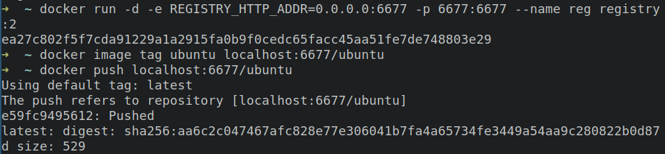
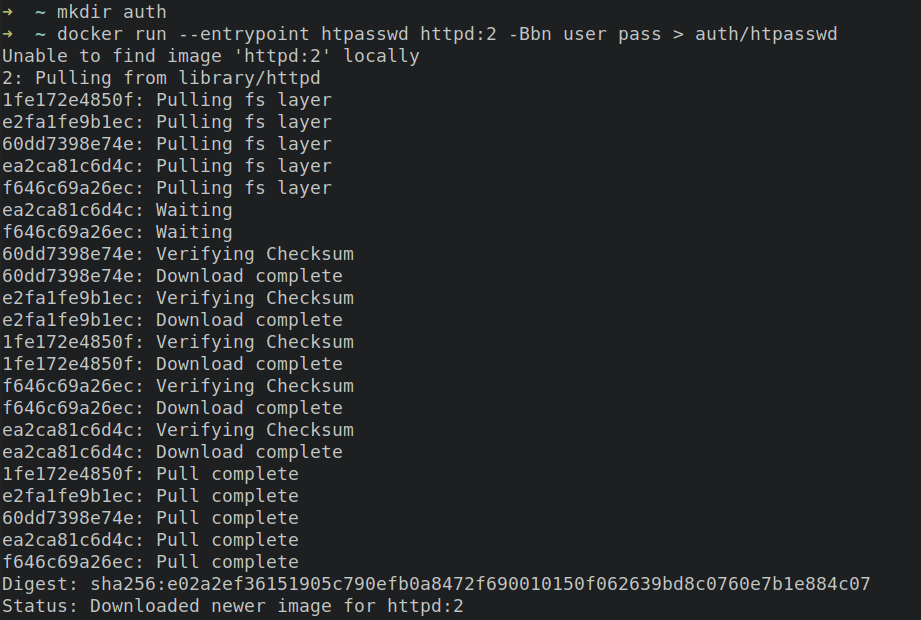
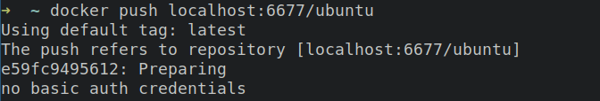
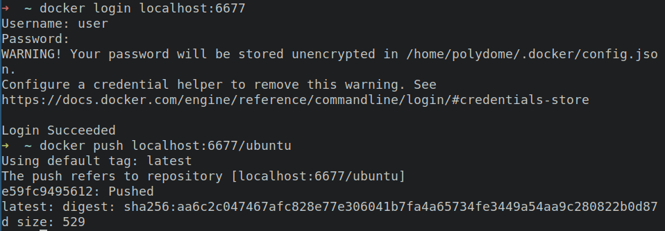

# Techonologie Chmurowe - zadanie 1
Autor: Łukasz Burzak

Aby zbudować obraz kontenera:
```shell
docker buildx build -t polydome/z1 .
```

Aby uruchomić kontener:
```shell
docker run -p 8080:8080 --rm -d --name lb-z1 polydome/z1
```

Aby odczytać logi serwera:
```shell
docker logs lb-z1
```

Aby sprawdzić ile warstw posiada zbudowany obraz:
```shell
docker history polydome/z1
```

Działanie usługi wystawionej w zewnętrznej lokalizacji: <br>


Budowanie na wskazane architektury, wraz z przesyłaniem na DockerHub:
```
docker run --rm --privileged multiarch/qemu-user-static --reset -p yes
docker buildx create --name container_builder --driver docker-container --bootstrap --use
docker buildx build -t polydome/z1 --platform linux/arm64/v8,linux/arm/v7,linux/amd64 --push .
```

## Dodatek 1
Konfiguracja wraz z komentarzami znajduje się w pliku:
<br>https://github.com/polydome/tc-z1/blob/master/.github/workflows/build-and-push.yml

Przykładowy przypadek działania cache: <br>
https://github.com/polydome/tc-z1/runs/6355292999?check_suite_focus=true#step:7:146


Konfiguracja GHCR wymaga wygenerowania Personal Access Token na GitHub z uprawnieniami:
- `delete:packages`,
- `read:gpg_key`,
- `repo`,
- `workflow`,
- `write:packages`.

Następnie jest on wykorzystywany jako hasło do repozytorium.

Po poprawnym przebiegu akcji, obraz znajduje się na repozytorium GHCR:


## Dodatek 2
1.
```shell
# Zmienna środowiskowa `REGISTRY_HTTP_ADDR` określa, na jakim adresie usługa nasłuchuje żądań
docker run -d -e REGISTRY_HTTP_ADDR=0.0.0.0:6677 -p 6677:6677 --name reg registry:2
# Nowy tag jest poprzedzony adresem usługi `registry`
docker image tag ubuntu localhost:6677/ubuntu
docker push localhost:6677/ubuntu
```

Wynik działań:


2.
Na początku należy utworzyć użytkownika, który będzie mógł dokonać uwierzytelnienia.
```shell
# Tworzy katalog przechowujący dane uwierzytelniające użytkowników
mkdir auth
# Tworzy użytkownika o nazwie "user" i haśle "pass" w pliku `auth/htpasswd`
docker run --entrypoint htpasswd httpd:2 -Bbn user pass > auth/htpasswd
```


Następnie należy uruchomić usługę `registry` z innymi argumentami:
```shell
docker stop reg
docker run -d \
	-p 6677:6677 \
	--restart=always \
	--name reg \
	-e REGISTRY_HTTP_ADDR=0.0.0.0:6677 \
	# Montuje katalog zawierający plik z danymi uwierzytelniającymi
	-v "$(pwd)"/auth:/auth \
	# Określa sposób uwierzytelnienia
	-e "REGISTRY_AUTH=htpasswd" \
	-e "REGISTRY_AUTH_HTPASSWD_REALM=Registry Realm" \
	# Określa lokalizację pliku zawierającego dane uwierzytelniające
	-e REGISTRY_AUTH_HTPASSWD_PATH=/auth/htpasswd \
	registry:2
```

Użycie komendy `push` bez uwierzytelnienia jest niedozwolone:


Po zalogowaniu `push` przebiega pomyślnie:

